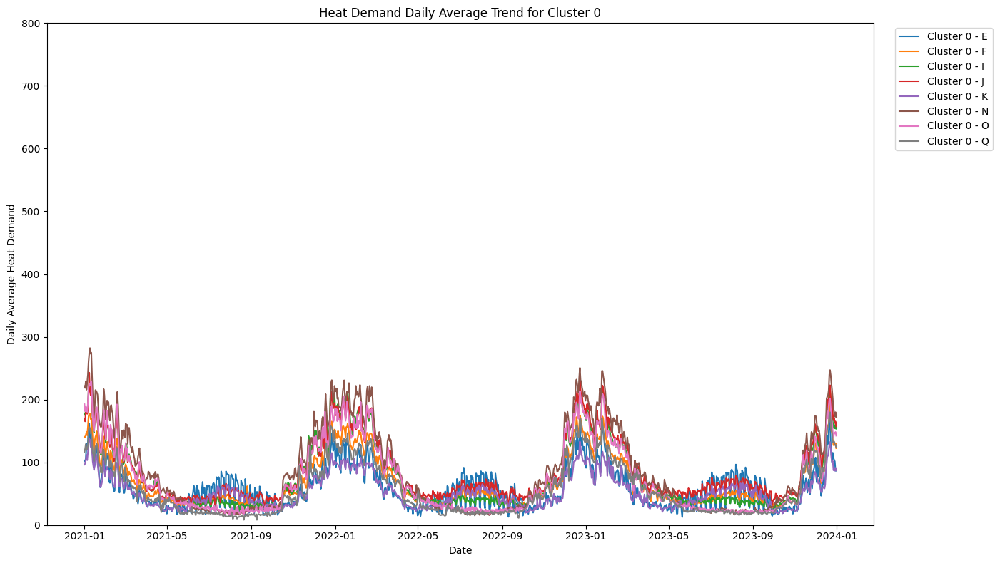
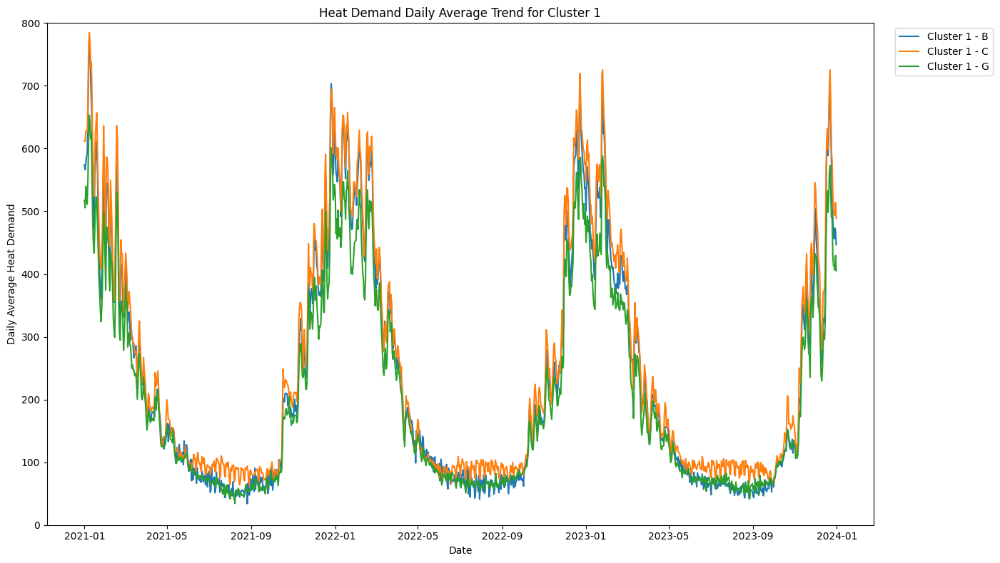
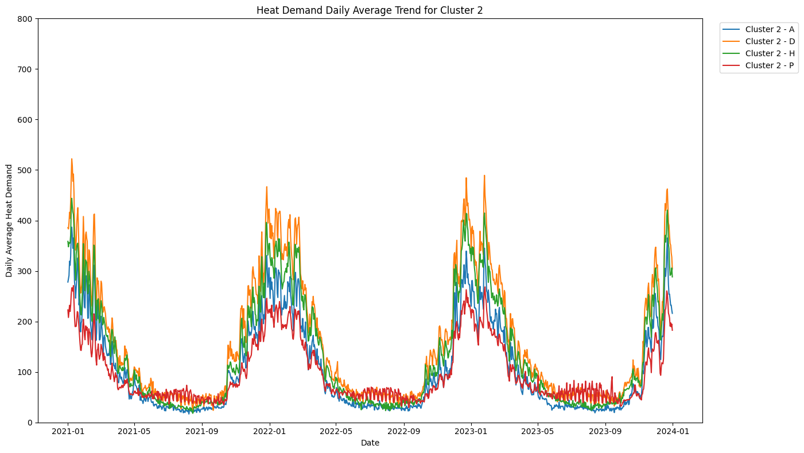
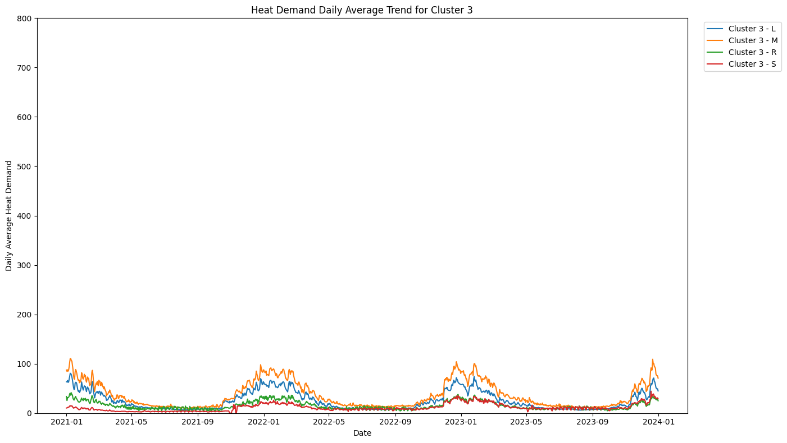
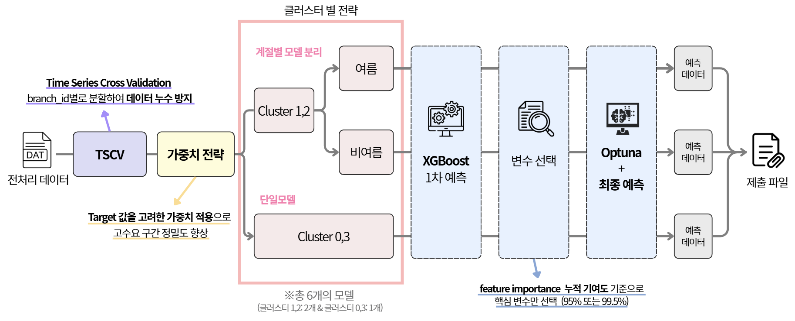

# 🏆 2025 날씨 빅데이터 콘테스트 - 지역난방 열수요 예측

*본 프로젝트는 2025 날씨 빅데이터 콘테스트에서 지역난방의 효율적 운영을 위한 데이터 기반 솔루션을 제안하였으며, 실제 에너지 관리 현장에 적용 가능한 실용적 모델을 개발하였습니다.*

## 📋 대회 개요
- **대회명**: 2025 날씨 빅데이터 콘테스트
- **주제**: 지역난방 열수요와 기상 데이터를 융합한 열수요 예측 모델 개발
- **기간**:
    - 대회 자료 배포: 5월 7일
    - 공모작 제출: 6월 11 ~ 6월 27일
    - 1차 심사: 7월 9일
    - 2차 심사: 8월 6일
- **성과**: 🏆 **장려상 수상**
- **팀명**: 체크난방

## 👥 참가자
|  이름 |  Github   |
|--------|-------------------|
| 고도현 | [@rhehgus02](https://github.com/rhehgus02)        |
| 서혜현 | [@hyehyunseo](https://github.com/hyehyunseo)       |
| 백지연 | [@wlsisl](https://github.com/wlsisl)           |
| 이수미 | [@SooMiiii](https://github.com/SooMiiii)         |


## 🎯 프로젝트 목표
열에너지는 전기와 달리 대규모 저장이 어렵기 때문에 실시간 수요에 맞춰 생산·공급을 조절하는 것이 필수적입니다. 특히 최근 기후변화로 인한 이상기온과 극한 날씨의 변동성이 커지면서, 정확한 열수요 예측의 중요성이 부각되고 있습니다.

본 프로젝트는 **지역별 열수요 패턴의 다양성을 고려한 클러스터 기반 예측 모델**을 개발하여, 효율적인 에너지 관리와 열공급 시스템의 스마트화에 기여하고자 합니다.

## 📊 데이터 분석 및 전략

### 🔍 주요 분석 전략
1. **시간적·공간적 특성 반영 클러스터링**
2. **기상 기반 파생 변수 생성**
3. **여름/비여름 구분 클러스터별 모델링**

### 📈 데이터 구성
- **관측치**: 499,301개
- **기간**: 2021년 1월 1일 ~ 2023년 12월 31일 (3년)
- **지점 수**: 19개 (`branch_id`)
- **변수**: 기상변수(온도, 습도, 풍속, 일사량 등) + 열수요 정보

## 🧩 핵심 방법론

### 1. K-Means 클러스터링
19개 지점을 열수요 패턴에 따라 4개 클러스터로 분류

| cluster | branch_id  | 설명  |
|---|---|---|
| Cluster0 | E, F, I, J, K, N, O, Q | 낮은 수준의 열수요, 여름에도 일정 수준 유지 |
| Cluster1 | B, C, G | 매우 높은 겨울 피크, 계절에 따른 등락이 가장 뚜렷 |
| Cluster2 | A, D, H, P | 중간 규모, 계절에 따라 등락 뚜렷 |
| Cluster3 | L, M, R, S | 전반적으로 매우 낮은 수요, 여름철의 수요는 거의 없음 |

<p float="left">
  
  
  
  
</p>


### 2. 파생 변수 엔지니어링

1. **시간 변수 및 이동평균**  
- 연도, 월, 요일, 주말 여부 포함  
- 순환성을 위한 sin/cos 변환 적용  
- 월별 기온 기준으로 계절 재분류  
- 기상 변수에 단기·장기 이동평균 적용  

2. **지연 변수**  
- 과거 최대 50시간 전 데이터까지 영향 확인  
- 계절성과 추세 제거 후 의미 있는 시차별 변수 추가  

3. **기상 기반 변수**  
- 일별 누적 일사량, 폭염·한파 플래그, 이슬점, 체감온도 등 물리적 특성 반영  
- 지점별로 임계온도를 저·중·고 세 구간으로 나누어 수요 반응 세밀 반영  
- 여름철 냉방 수요 증가를 반영하기 위해 불쾌지수, 지점, 여름 여부의 삼중 상호작용 변수 도입


### 3. 클러스터별 맞춤 모델링

- **총 6개 모델 구축**: Cluster 0,3 (단일모델) + Cluster 1,2 (여름/비여름 분리모델)
- **XGBoost 기반 예측**: 비선형 관계 학습과 과적합 방지
- **가중치 적용**: 고수요 구간 예측 정밀도 향상을 위한 타깃 비례 가중치

## 📊 성능 결과

| 클러스터 | 모델 구분 | RMSE |
|---------|-----------|------|
| Cluster 0 | 단일 | 12.14 |
| Cluster 1 | 여름 | 13.65 |
| Cluster 1 | 비여름 | 34.60 |
| Cluster 2 | 여름 | 11.24 |
| Cluster 2 | 비여름 | 28.02 |
| Cluster 3 | 단일 | 4.52 |

**최종 RMSE: 13.96 (4위)**

## 🔍 모델 해석 (SHAP 분석)
- **Cluster 0,3**: `겨울 여부`, `체감온도 7일 이동평균`이 주요 영향
- **Cluster 1,2 (여름모델)**: `시간대`, `불쾌지수`가 핵심 요인
- **Cluster 1,2 (비여름모델)**: `체감온도 이동평균`, `계절성`이 중요

## 🚀 활용 방안 및 확장성

### 실무 적용
- **에너지 과잉생산 방지**: 정확한 수요 예측을 통한 효율적 에너지 공급
- **설비 운전 최적화**: 보일러 가동시점, 펌프 유량의 자동 제어 시스템
- **실시간 예측 시스템**: 기상정보 연계 수요 예측으로 운영효율 극대화

### 확장 가능성
- 신도시 및 신규 열원 도입시 기초 수요 예측 모델 활용
- 스마트 열공급 체계 구축의 기반 기술
- 지역별 맞춤형 에너지 관리 솔루션 개발

## 🛠️ 기술 스택
- **언어**: Python
- **주요 라이브러리**: 
  - XGBoost (예측 모델)
  - scikit-learn (클러스터링, 전처리)
  - SHAP (모델 해석)
  - Optuna (하이퍼파라미터 최적화)
  - pandas, numpy (데이터 처리)
  - matplotlib, seaborn (시각화)

## 📁 프로젝트 구조
```
├── data/                  # 데이터셋
├── code/                  # 제출 코드
├── notebooks/             # 분석 노트북
│   ├── EDA/               
│   ├── modeling/          
│   └── preprocessing/     
├── images/                # 이미지
└── docs/                  # 발표자료, 보고서
```

## 추가 자료
- [공모전 사이트](https://bd.kma.go.kr/contest/main.do)
- 보고서
- 발표 자료